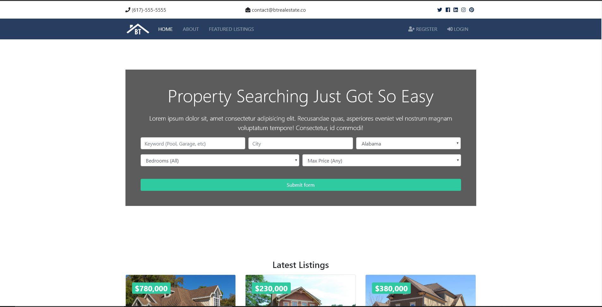
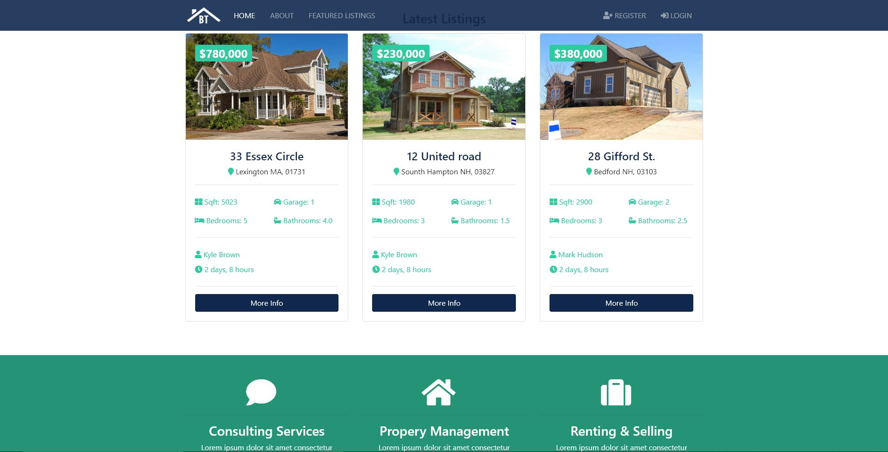
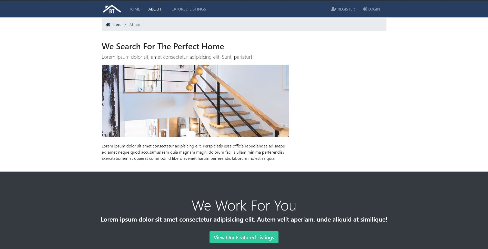
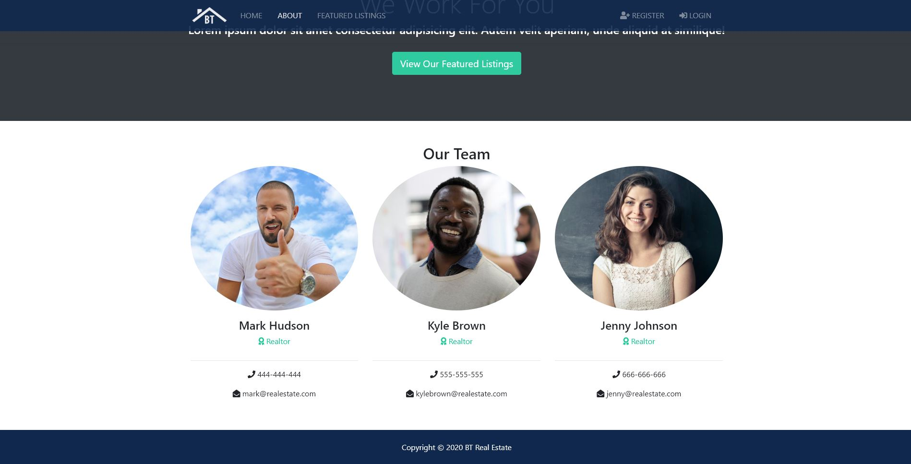
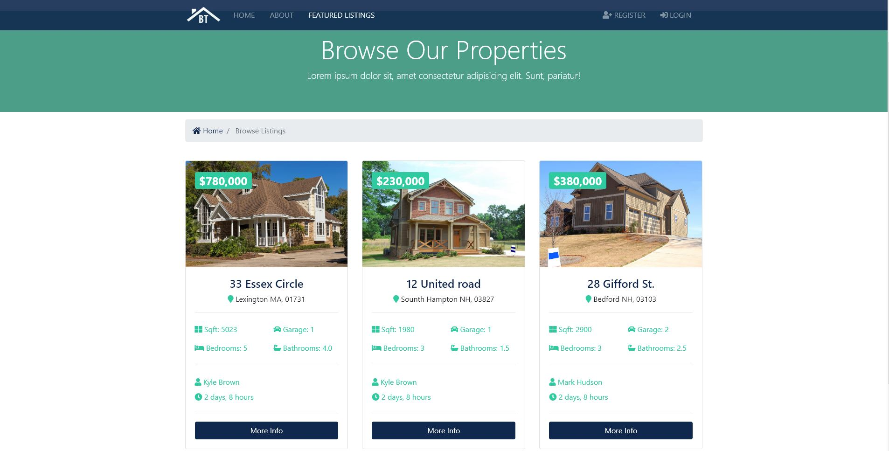
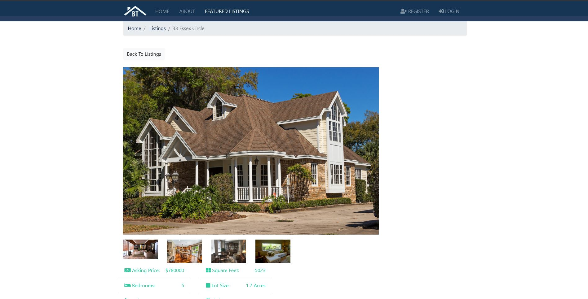
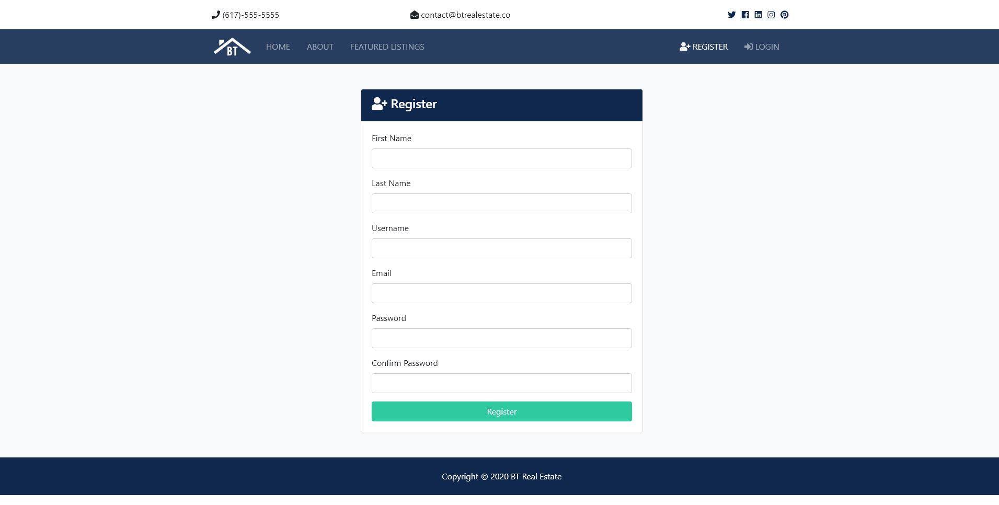
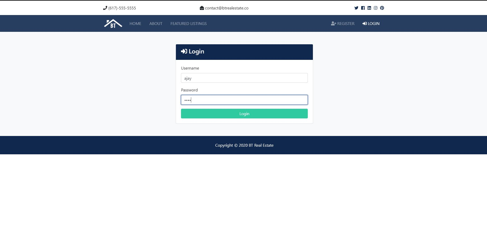
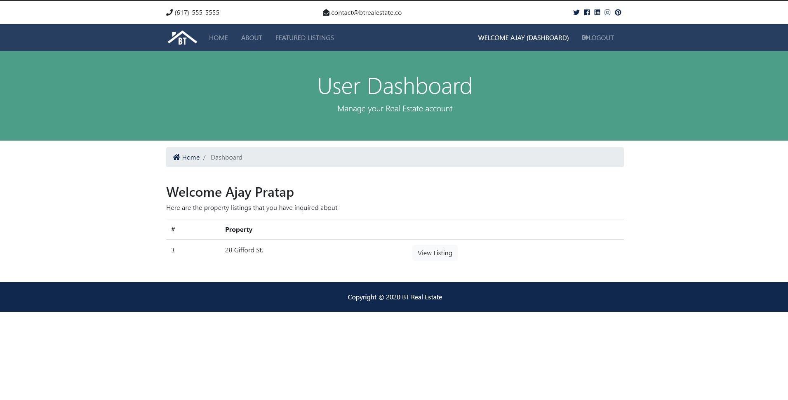

# Django-Real-Estate-Website
This is a full fledged website of real estate based on django

This is a Django based website made for real estate with features such as-
* Login
* Registration
* User specific Dashboard
* Enquiry form
* Customised Admin Panel
* Pagination

Steps to run this project-
* Pull this project
* Make a virtual environment
* Try to run this project it will automatically tell which dependencies are missing, install them
* Project is up and running

Below are the screenshots of Project

